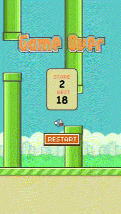

# Flappy Bird

### Harel Alejandro Olguín Gaytán & Jorge Francisco Arriaga Escamilla

## Project Overview

This is a project that was made for the OOP class, as part of the project, it was required the use of main Object Oriented principles, like **inheritance**, **packages**, **encapsulation** and **generics**, etc. This project not only uses those principles, but also applies a lot of new interesting stuff like design patterns like **singleton**, use of graphic classes such as **Swing** and all of its components, and the use of **Threads** and **Binary Files** for making the game possible. Although the project as itself is finished, there are still things that can be improved, and given the time in the future, i might pursue the correnction or the overhaul of the project.

If you are interested in downloading the source file or creating your own branch just clone the repo:

```bash
git clone https://github.com/Harel06533/FlappyBird.git
```

All dependencies, source code and assets are already avaliable here, and as it wasn't required any external frameworks or IDE's, the project should work just fine by just cloning the repository.

## Game

Our Flappy Bird project is a simple _copy_ of the original Flappy Bird game, its core is very simple and easy to understand, the player embodies a bird which will need to pass an infinite amount of randomly generated pipe obstacles without crashing them, for every succefully pipe passed, it adds a score to the player.


### Base Funcionality

The game is divided in _three_ main functionalities, the `App` funcionalites, the game `Components` and some basic `Utilities` which can be used alongside the whole program.

- **App**: This funcionality brings the basic _UI_ components, the game logic and `main` method are also present, from here, the whole program can be executed and all of the components are integretad.
- **Components**: The components are the core of the program, each Component is designed to be, in some way, independent from each other, except for one, which is the _Bird_. Almost all components interact with the Bird in some way or another, the Bird also interacts with the `App` functionality. Here is a more in-deep explanation of each Component.
  - `Bird`: This is the most important component of them all, as it is the playable bird which will be the center of interaction from all of the program, this component can only exist one time for the whole execution, so a _Singleton_ design pattern is used here.
  - `Pipe`: The individual Pipe class, this just sets the individual attributes and methods of the single pipe, no interaction or born logic whatsoever.
  - `PipeHandler`: This is the class that implements, using an `ArrayList`, the born and collision logic for the pipes, this class implements the spawning and despawing of the pipes, as also implements the score and collision for each pipe.
  - `Score`: The score component is very important, as it is the most catching part of the game, this class allows for a restarting current score value, as well as the fetching of the highscore value from a local binary file, that stores the highscore.
  - `Background, Ground, Logos`: This three components have more to do with the layout of the game, more than the user interaction itself.
- **Utilities**: This main utilites offer multiple premade tools that will make some of the work in the game a little bit easier. Tools such as _random number generator_, _image, sound and binary file loader_ and some _Constants_ such as paths, number values and strings that will be required in some way or another in the game.

## Game Logic

Knowing how the game is structured, now i can explain how all of the program classes interact with each other to generate a functional game.

First of all, the goal from the start, was to make each component of the game, somehow to act independently from the rest of the components, but being controlled and called from a mayor global class that integrates each component. This was achieved by using what are known as _Game states_. Game states provide the tools to decide when some of the components will have certain behavior. For example, if the _Bird_ has not yet started the game, nor the pipes nor the score should be avaliable.

To achieve when the Game decides to change state, first it need to take this decision based on the Bird state. The Bird state is changed on every component, i consider the Bird being for the components what the Game is for the bird. Though each component is independent from eachother, each component can and will change the state of the bird if needed. For example, each `Pipe` checks if the bird has crashed or has passed the score zone. The `Ground` checks if the bird has reached its height, etc. This allows for certain things to change on the Bird, which will eventually change the Game States.

### Game States

There are three different Game States which can be changed based on the Bird's.

- `GAME_READY`: This state defines the moment where the game is ready to be started, in this state, the bird has no velocity, and neither the pipes or the score are shown. The bird state here is `BIRD_READY`.

  

- `GAME_STARTED`: In this state, the title logos are not longer drawed, the bird now has a **y** velocity which needs to be countered with pressing space. Pipes start to get drawn and to be shown are disposed. The bird state in this moment is `BIRD_JUMPING`.

  

- `GAME_STOPPED`: In this state, the pipes and the ground have no velocity anymore, the bird is no longer animated and the game over logos are drawn, which display the current score that was achieved, and the highest score ever. The bird statie is `BIRD_DEAD`.

  

There are a lot more of funcionalities and though a full documentation is comming soon, it is encouraged to the people to check and read the code. I'm open to suggestion as learning is always my priority.
